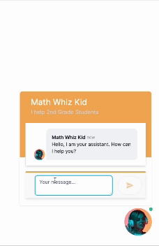

<div align="center">


# Assistants Hub

### The Open Source Assistants Management Portal

<p>


</p>

---

<p align="center">
  <a href="https://docs.assistantshub.ai/docs/category/demos">Demo</a> •
  <a href="https://docs.assistantshub.ai/docs/intro">Tutorials</a> •
  <a href="https://assistantshub.ai">Assistants Hub</a> •
</p>
</div>

---

Welcome to Assistants Hub, where you can **Build, Integrate, and Deploy AI Assistants in Minutes**. This project leverages the power of Next.js, OpenAI, Google and other AI services to provide a streamlined platform for creating sophisticated AI assistants. Our mission is to democratize AI development, making it accessible for developers, hobbyists, and businesses to innovate and implement AI solutions effortlessly.

---


## Key Features

- **Rapid Development**: Jumpstart your AI assistant project with our easy-to-follow setup and comprehensive documentation.
- **Seamless Integration**: Connect your assistant with a wide array of APIs and services to enhance its functionality and intelligence.
- **Community-Powered**: Tap into the collective knowledge of a vibrant community dedicated to pushing the boundaries of AI assistants.

Explore our [Guides](https://docs.assistantshub.ai/docs/category/guides) to get started with Assistants Hub or check out our [Demos](https://docs.assistantshub.ai/docs/category/demos) to see our AI assistants in action.

Below are some exciting AI assistant demos generated with Assistants Hub you can play with:

- [Blimey! British Slang](https://docs.assistantshub.ai/docs/demos/british-slang-generator)
- [Math Whiz Kid](https://docs.assistantshub.ai/docs/demos/math-tutor)
- [Customer Support Agent](https://docs.assistantshub.ai/docs/demos/customer-support-agent)
- [Creative Recipe Suggestions](https://docs.assistantshub.ai/docs/demos/creative-recipe-suggestions)



</div>

## Getting Started

To get started with Assistants Hub, you'll need to have Node.js installed on your machine. Follow the steps below to set up your development environment.

### Prerequisites

- Node.js (LTS version recommended)
- pnpm

### Installation

1. Clone the repository

   ```bash
   git clone https://github.com/assistants-hub/assistantshub.ai
   ```

2. Navigate to the project directory

   ```bash
   cd assistantshub.ai
   ```

3. Install the dependencies

   ```bash
    pnpm install
   ```

4. Configure your environment: Rename `.env.template` to `.env` and fill in the necessary settings.

5. Configure Postgres Database

   - Install Postgres on your machine
   - Create a new database
   - Update the DATABASE_URL in the .env.local file with your database connection string
   - Install `timescaledb` extension in your database

6. Start the development server

   ```bash
   pnpm dev
   ```

Visit http://localhost:3001 in your browser to see your AI assistant in action.

## Contributing

Your contributions can help make Assistants Hub even better. If you're interested in contributing, please read our [CONTRIBUTING.md](./CONTRIBUTING.md) file to learn how you can get involved.

## Support

Encountered a bug or need help? Open an issue in our GitHub repository, and we'll do our best to address it.

## License

Assistants Hub is released under the [MIT license](./LICENSE), promoting open and collaborative development.

## Legal Disclaimer

Assistants Hub incorporates artificial intelligence (AI) features powered by technologies from Google LLC and OpenAI, Inc. These AI tools process inputs you provide to generate outputs and functionalities within this service. By using Assistants Hub, you acknowledge and agree to the following:

### AI Model Limitations

The AI features are based on machine learning models and are not infallible. Outputs generated by AI features can sometimes be inaccurate, inappropriate, or misleading. Users should exercise judgment and discretion when using information provided by AI features.

### Data Use and Privacy

Any data you provide while using the AI features may be processed and stored by Google LLC and OpenAI, Inc., as well as Assistants Hub, in accordance with our Privacy Policy. Please review our Privacy Policy to understand how your data is used and protected.

### Intellectual Property

Outputs generated by AI features may be influenced by the data on which the AI models were trained but do not confer any ownership of underlying AI technology or intellectual property rights. All intellectual property rights in the AI technology and its outputs remain with their respective owners (Google LLC, OpenAI, Inc., or their affiliates).

### No Warranty

Assistants Hub provides AI features "as is" and without warranty of any kind, either express or implied. We do not guarantee the availability, accuracy, completeness, reliability, or timeliness of the AI features provided.

### Limitation of Liability

To the fullest extent permitted by law, neither Assistants Hub, nor Google LLC, nor OpenAI, Inc., nor any of their affiliates shall be liable for any direct, indirect, incidental, special, consequential, or punitive damages arising out of or in connection with your use of the AI features.

### Changes and Updates

Assistants Hub reserves the right to modify or discontinue AI features at any time without notice. We recommend checking this disclaimer periodically for any changes.

### Affiliation and Branding

Assistants Hub is an independent entity and is not affiliated with Google LLC, OpenAI, Inc., or any of their subsidiaries or affiliates. The names Google and OpenAI, and all related logos, products, and service names are trademarks of their respective owners or their affiliates. These names and marks are used herein solely for identification purposes. No sponsorship or endorsement by Google LLC, OpenAI, Inc., or any of their affiliates is intended or implied.

By continuing to use Assistants Hub, you agree to these terms. If you do not agree with any part of this disclaimer, please do not use the AI features offered by this service.

## References

- [Next.js Documentation](https://nextjs.org/docs)
- [Configuring TimescaleDB with Prisma](https://gist.github.com/janpio/2a425f22673f2de54469772f16af8118)

## Acknowledgements

We extend our gratitude to:

OpenAI and Google for their exceptional APIs that powers the intelligence of our assistants.
The Next.js community, for providing the robust framework that makes this project possible.

Thank you for exploring Assistants Hub. We're eager to see the incredible AI assistants you'll build and deploy!
